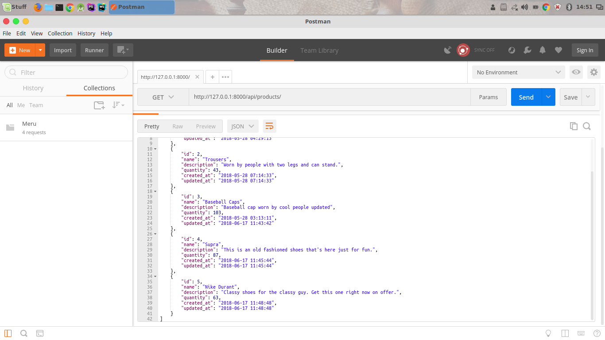
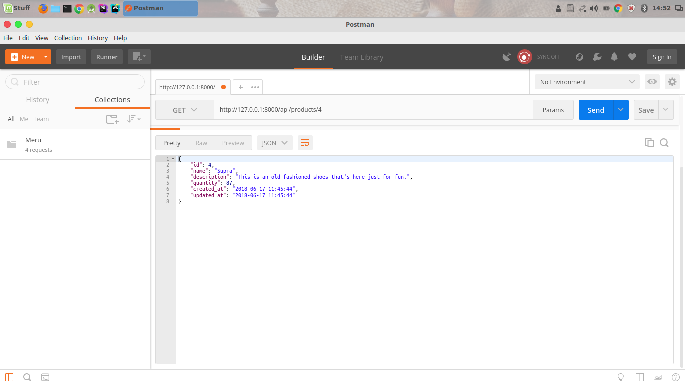

## REST and Read
This is a simple REST API built using Laravel (Before the Laravel Resources era :smile:)

It shows the basic CRUD operations in Laravel 5.5

## The Result?
```
127.0.0.1:8000/products
```


```
127.0.0.1:8000/products/2
```

### Resources update coming soon ...   