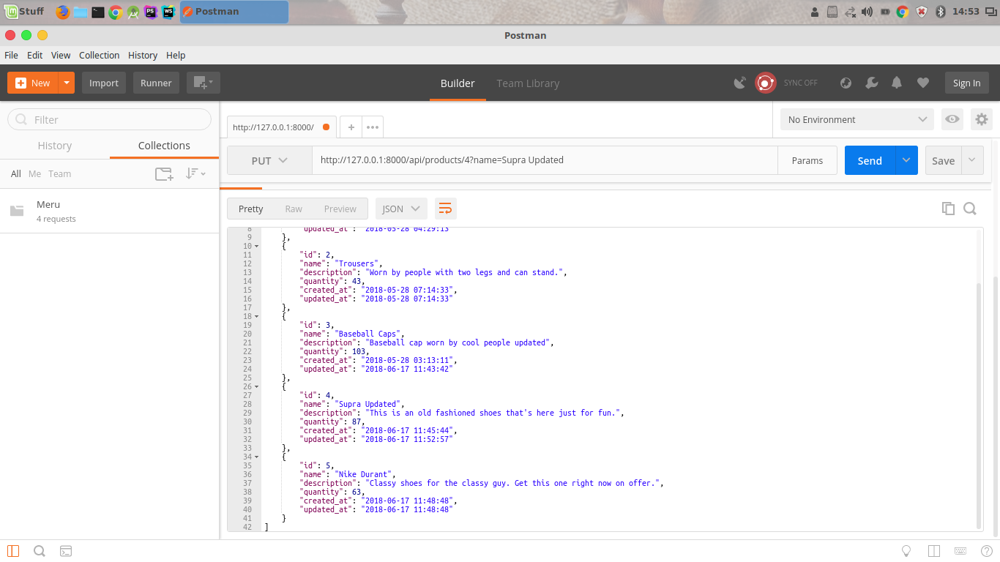

## REST and Read
This is a simple REST API built using Laravel (Before the Laravel Resources era :smile:)

>It shows the basic **API CRUD** operations in Laravel 5.5

## The Result?
>### Retrieving All Items

```php
return ModelName::all();
```

```
http://localhost:8000/products
```


>### Retrieving One Item
```php
return ModelName::findOrFail($id);
```
```
http://localhost:8000/products/4
```


>### Update
Sending a **PUT** request

```php
(ModelName::findOrFail($id))->update($request->all());
```

This isn't how the code is written. Am just showing what's happening :smiley:




>### Delete Item
Sending a **DELETE** request

```php
(ModelName::findOrFail($id))->delete();
```

### Resources update coming soon ...   